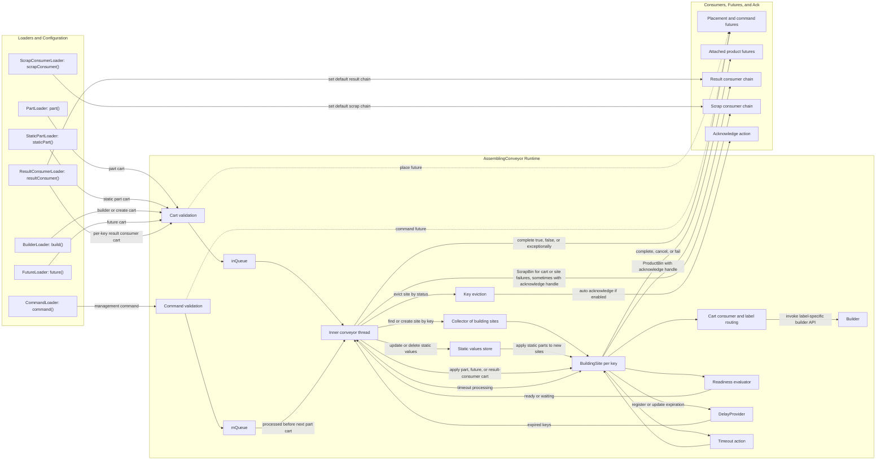

# Conveyor High-Level Overview

This diagram is a structural overview of an `AssemblingConveyor`, not a single-message sequence. It shows the main loader entry points, the two internal queues, the inner conveyor thread, the collector of active building sites, builder and readiness processing, timeout support, consumer outputs, attached futures, eviction, and acknowledge handling.

One `BuildingSite` box in the diagram stands for many active sites stored in the collector, one per key. To keep the diagram readable, related flows are grouped together instead of showing every individual command variant. `resultConsumer()` is shown in both roles it can play: configuring the default result chain and sending per-key result-consumer carts. `scrapConsumer()` is conveyor-level configuration.

