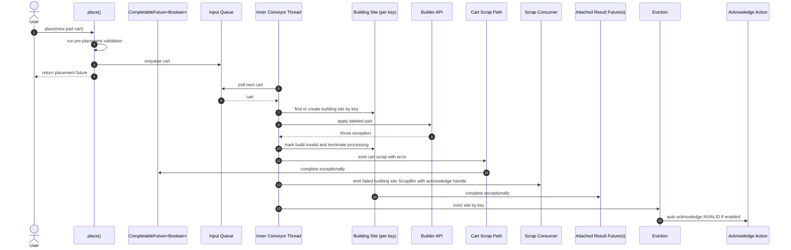

# Part Placement Builder Exception Path

This diagram shows a focused failure path for `AssemblingConveyor`: a new part is placed, the builder API throws while applying that part, the current build is marked invalid, the failed build is sent to the scrap consumer, and the placement `CompletableFuture<Boolean>` completes exceptionally.

The diagram stays intentionally narrow. It does not include timeout, keep-running, recovery, or shutdown branches. On this path, the cart scrap handling completes the placement future exceptionally, the site scrap path sends a `ScrapBin` with an acknowledge handle to the scrap consumer, any result futures attached to the building site are completed exceptionally, and the site is evicted. During eviction, auto-acknowledge may call the configured acknowledge action for `Status.INVALID`.

