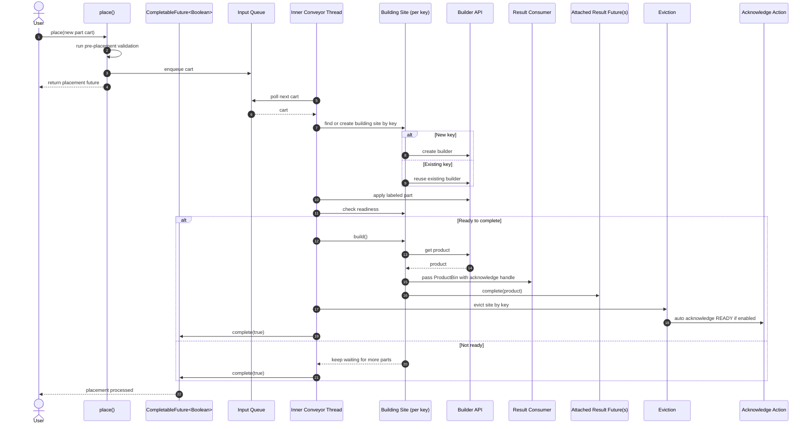

# Part Placement Happy Path

This diagram shows the normal `AssemblingConveyor` flow for placing a new part. It intentionally leaves out rejection, timeout, and shutdown side paths so the core part-placement lifecycle stays easy to read.

The flow starts when a caller submits a new cart with `place()`. After basic pre-placement validation, the cart is queued and `place()` immediately returns the cart's `CompletableFuture<Boolean>` to the caller. The conveyor's inner worker thread later processes the cart, routes it to an existing or newly created building site for the key, and applies it through the builder API. If the build becomes ready, the conveyor builds the product, passes a `ProductBin` with an acknowledge handle to the result consumer, completes any attached result futures with the product, and then evicts the building site. During eviction, auto-acknowledge may call the configured acknowledge action for `Status.READY`. If the build is still not ready, the site stays open and waits for more parts. On this happy path, once the cart has been processed, the placement future is completed successfully.

