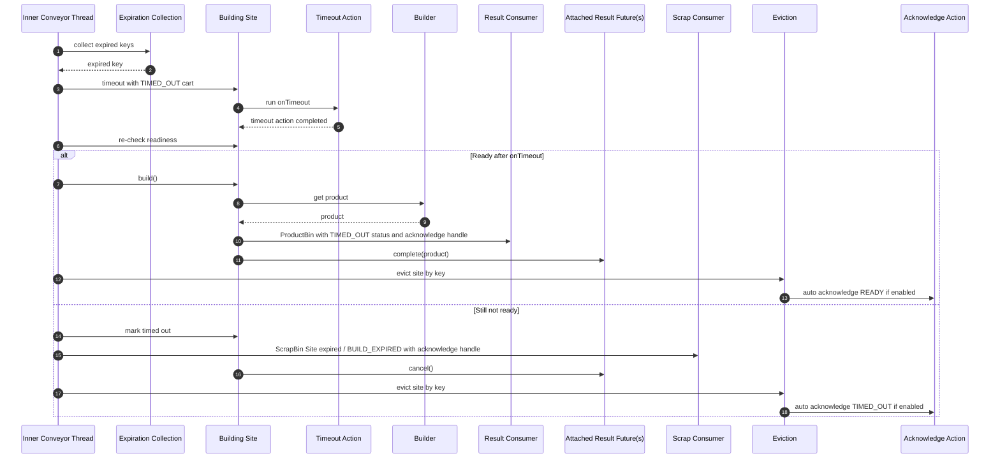

# Timeout Action: Ready Vs Not Ready

This diagram shows the `AssemblingConveyor` timeout path when a building site has a timeout action. It starts when the inner conveyor thread detects an expired key during timeout collection, invokes the site's timeout handling, and then immediately re-checks readiness.

The diagram focuses on the two main outcomes after `onTimeout()` runs:
- the timeout action makes the build ready, so the product is built and delivered with `Status.TIMED_OUT`, attached result futures complete with the product, and the site is later evicted
- the timeout action still leaves the build not ready, so the site expires, is sent to the scrap consumer, attached result futures are canceled, and the site is evicted

It intentionally omits the no-timeout-action branch, postpone-on-timeout rescheduling, and timeout-action-exception handling. The timeout result or scrap bin carries an acknowledge handle; the diagram also shows the separate auto-acknowledge call that may happen during eviction. In current code, a timeout-completed build is evicted with acknowledge status `READY`, while an expired unfinished build is evicted with acknowledge status `TIMED_OUT`.

